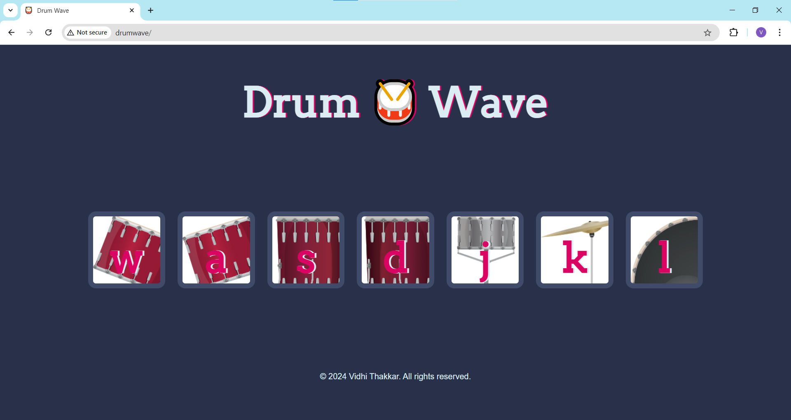

# <h1 align="center">Drum 🥁 Wave</h1>
An interactive web-based drum set that lets users play drum sounds using keyboard keys or on-screen buttons.


---

## Project Description

The Drum Wave web app is designed for music enthusiasts and aspiring drummers who want to practice rhythms and experiment with drum sounds, without needing a physical drum set. It provides a virtual, easy-to-use drum kit that can be played using keyboard keys or on-screen buttons. This project allows anyone to engage with drums in an interactive, fun, and educational way.

---

## Table of Contents
- [Project Title and Overview](#project-title-and-overview)
- [Project Description](#project-description)
- [Features](#features)
- [Technology Stack](#technology-stack)
- [Demo and Preview](#demo-and-preview)
- [Installation](#installation)
- [Usage](#usage)
- [Configuration](#configuration)
- [Testing](#testing)
- [License](#license)
- [FAQs](#faqs)
- [Contact Information](#contact-information)

---

## Features

- **Interactive and Responsive**: Play drum sounds using keyboard keys (W, A, S, D, J, K, L) or on-screen drum pads, with visual button animations.
- **Realistic Sound Effects**: Enjoy authentic drum sounds for toms, snares, and kick bass.
- **Cross-Platform Compatibility**: Optimized for both desktop and mobile browsers.

---

## Technology Stack

- **Frontend**: HTML5, CSS3, JavaScript
- **Libraries**: None
- **Tools**: VS Code

---

## Demo and Preview



---

## Installation

1. Clone the repository:
```bash
git clone https://github.com/ThakkarVidhi/virtual-drumset.git
```

2. Navigate to the project folder:
```bash
cd virtual-drumset
```

3. Open index.html in your browser.

---

## Usage

1. Press the designated keys (W, A, S, D, J, K, L) to play different drum sounds.
2. Click the drum pads to play sounds.
3. The button will visually animate when pressed.

---

## Configuration

There are no special configuration settings for this project.

---

## Testing

This project does not include automated tests. To test the application, simply open it in your browser and interact with the drum set.

---

## License

This project is licensed under the [MIT License](LICENSE).  


---

## FAQs

### **How do I change the key bindings?**  
At the moment, key bindings are hard-coded. However, you can:  
1. Open an issue to suggest a feature for customizable key bindings.  
2. Contribute directly by adding this feature and submitting a pull request.  

> **Tip:** Look into the `index.js` file for the key binding logic if you'd like to customize it manually.

---

## Contact Information

You can reach me at [vidhithakkar.ca@gmail.com](mailto:vidhithakkar.ca@gmail.com) or via [LinkedIn](https://www.linkedin.com/in/vidhi-thakkar-0b509724a/).
